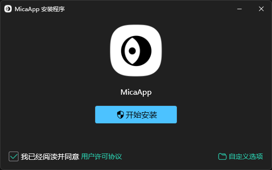
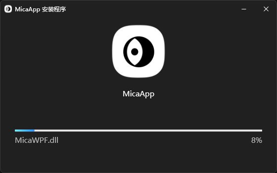

# 📦MicaSetup

MicaSetup is a universal advanced installation package generation tool project that supports various features and allows customization of the full entire installation process.

## 🌒ScreenShots

## 😋Demos

> The programs using MicaSetup.

[GenshinMatrix/Fischless](https://github.com/GenshinMatrix/Fischless)

[babalae/better-genshin-impact](https://github.com/babalae/better-genshin-impact)

[babalae/better-wuthering-waves](https://github.com/babalae/better-wuthering-waves)

## 💡Features

### 🌟Advanced Features

| Features            | Completion | Addition                                                     |
| ------------------- | ---------- | ------------------------------------------------------------ |
| Mica Backdrop       | ☑          | Support Windows11 Mica Backdrop.                             |
| Theme               | ☑          | Support Dark and Light theme.                                |
| Archive File        | ☑          | Pack your app with `7z.exe`, so it's easy to customize your archive file or not. |
| Animations          | ☑          | Support a lot of advanced animations. Such as Indeterminate ProgressBar, supported when your installation is no progress hint. |
| ~~Notification~~    | ~~☑~~      | ~~Windows10 (or higher) Notification.~~                      |
| HiDPI               | ☑          | Support to process DPI awareness.                            |
| Firewall            | ☑          | Support allows your app to access the Network through Windows Firewall Policy. |
| Anti Unpacking      | ☑          | Support encryption type archive file package. Needs create your app archive file with password firstly. Also can sign your setup program by `.snk`. |
| .NET SDKs Installer | 🔲          | Auto detecte and install the .NET/.NET Core/.NET Framework Runtime. [Download .NET SDKs for Visual Studio](https://dotnet.microsoft.com/en-us/download/visual-studio-sdks) |
| MSIX Installer      | 🔲          | Using MSIX package instead of archive file. Provide the function the same as following command. `certmgr.exe -add app.cer -s -r localMachine AuthRoot`. |
| Online Installer    | 🔲          | Using Network instead of archive file.                       |

### ✨General Features

| Features           | Completion | Addition                                                     |
| ------------------ | ---------- | ------------------------------------------------------------ |
| Host Builder       | ☑          | Support a simple HostBuilder for handling setup configs.     |
| Debugger           | ☑          | Unlike other installation architectures, too difficult to debug. Support using VS2022 (or higher) to debug codes. |
| WindowChrome       | ☑          | Support WindowChrome to keep native window style instead of borderless style. |
| Shortcut           | ☑          | Support to create your app shortcut (`.lnk`).                |
| Fork Process       | ☑          | Support setup process forked itself to avoid the file lock.  |
| Folder Picker      | ☑          | Support advanced Folder Picker by `WindowsAPICodePack-Shell`. |
| Globalization      | ☑          | Support English, Chinese and Japanese nowaday. Support other languages customized by yourself. |
| Registry           | ☑          | Support x86/x64 registry.                                    |
| Create StartMenu   | ☑          | Support to create Start Menu in system folder.               |
| Create QuickLaunch | ☑          | Support to create Quick Launch shortcut (`.lnk`). Quick Launch has been obsoleted since Windows 10. |
| Create Uninst      | ☑          | Support to create `Uninst.exe` for system uninstallation.    |
| Delay Uninst       | ☑          | Support to delete file delay until reboot. Useful for handling when uninst files fails. |
| Auto Run           | ☑          | Support to make your installed app auto run.                 |
| Security Control   | ☑          | Support to make your installed path Allow Full File Security. |
| Install Font       | 🔲          | Support to install your fonts into system.                   |
| Install Silent     | 🔲          | Support silent installation using CLI `/q`. Useful for auto updating in the background. |
| Install Automate   | 🔲          | Support no interactive installation using CLI `/a`. Useful for auto updating in the foreground. |

## 🎛️Personalized Controls

| Controls           | Completion | Addition                                          |
| ------------------ | ---------- | ------------------------------------------------- |
| WindowX            | ☑          | Support Mica Backdrop. Support WindowChrome. |
| SetupProgressBar   | ☑          | Support Indeterminate Animation.                  |
| MessageBoxX        | ☑          | Simple MessageBox instead of Classics.            |
| SmoothScrollViewer | ☑          | Support smoothly scrolling.                       |

## 🔣Toolkits

| Toolkits     | Completion | Addition                                                     |
| ------------ | ---------- | ------------------------------------------------------------ |
| Icon Creator | ☑          | Creating the universal Squircle like icon. [More infomation](build/MicaSetup.Tools/MicaSquircle/README.md). |
| Trim Font    | ☑          | Only MicaSetup v1 needed. [More infomation](https://github.com/lemutec/MicaSetup/tree/v1/src/MicaSetup.Tools/MicaFontTrim). |

## 📖Usage & Wikis

> 🚧Under construction🚧

### ⚙️Debug Codes

Run the `setup_dummy.cmd` for creating some dummy things used in project.

Such as `publish.7z` as your app published package and full size font used in Setup programs.

And then Run VS2022 (or higher) as Admin to open the sln.

### 📦Create Setup

Run the `setup_build.cmd` for building the full Setup programs.

Command Flow:

1. Build my app, named `MicaApp` using `dotnet publish`.
2. Pack my app using `7z.exe`.
3. Build Uninst, named `Uninst.exe` using `msbuild`.
4. Build Setup, named `MicaSetup.exe` using `msbuild`.

## 🚀Contributes

🈺Welcome PRs, issuses, wikis, demos.

## 🌟Components

Including follow [components](COMPONENTS.md).

## 📑License

This software codes are licensed under the [MIT](LICENSE) License.

