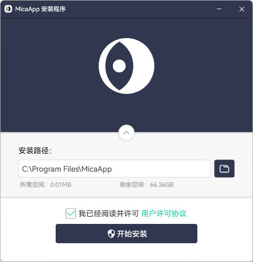
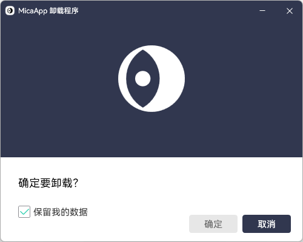

# 📦MicaSetup

MicaSetup is a universal advanced installation package generation tool project that supports various features and allows customization of the full entire installation process.

## 🌒ScreenShots

🚧Under construction🚧

## 💡Features

### 🌟Advanced Features

| Features         | Completion | Addition                                                     |
| ---------------- | ---------- | ------------------------------------------------------------ |
| Mica Backdrop    | ☑          | Support Windows11 Mica Backdrop.                             |
| Theme            | 🔲          | Support Dark and Light theme.                                |
| Archive File     | ☑          | Pack your app with `7z.exe`, so it's easy to customize your archive file or not. |
| Animations       | ☑          | Support a lot of advanced animations. Such as Indeterminate ProgressBar, supported when your installation is no progress hint. |
| Trim Font        | ☑          | Trimming fonts to reduce their size.                         |
| Sync Assembly    | 🔲          | Sync your app assembly version to create the same version setup. |
| Icon Creator     | ☑          | Creating the universal Squircle like icon. [More infomation](src/MicaSetup.Tools/MicaSquircle/README.md). |
| MSIX Installer   | 🔲          | Using MSIX package instead of archive file.                  |
| Notification     | ☑          | Windows10 (or higher) Notification.                          |
| Online Installer | 🔲          | Using Network instead of archive file.                       |
| High DPI         | ☑          | Support to process DPI awareness.                            |
| Anti Unpacking   | ☑          | Support encryption type archive file package. Needs create your app archive file with password firstly. Also can sign your setup program by `.snk`. |

### ✨General Features

| Features         | Completion | Addition                                                     |
| ---------------- | ---------- | ------------------------------------------------------------ |
| Host Builder     | ☑          | Support a simple HostBuilder for handling setup configs.     |
| Debugger         | ☑          | Unlike other installation architectures, too difficult to debug. Support using VS2022 (or higher) to debug codes. |
| WindowChrome     | ☑          | Support WindowChrome to keep native window style instead of borderless style. |
| Shortcut         | ☑          | Support to create your app shortcut (`.lnk`).                |
| Fork Process     | ☑          | Support setup process forked itself to avoid the file lock.  |
| Folder Picker    | ☑          | Support advanced Folder Picker by `WindowsAPICodePack-Shell`. |
| Globalization    | ☑          | Support English, Chinese and Japanese nowaday. Support other languages customized by yourself. |
| Registry         | ☑          | Support x86/x64 registry.                                    |
| Create Uninst    | ☑          | Support to create `Uninst.exe` for system uninstallation.    |
| Delay Uninst     | ☑          | Support to delete file delay until reboot. Useful for handling when uninst files fails. |
| Auto Run         | ☑          | Support to make your installed app auto run.                 |
| Security Control | ☑          | Support to make your installed path Allow Full File Security. |
| Install Font     | 🔲          | Support to install your fonts into system.                   |
| Install Silent   | 🔲          | Support silent installation using CLI `/q`. Useful for auto updating in the background. |
| Install Auto     | 🔲          | Support no interactive installation using CLI `/a`. Useful for auto updating in the foreground. |

## 📖Wikis

🚧Under construction🚧

Some usage ideas [here](src/README.md).

## 🚀Contributes

🈺Welcome PRs, issuses, wikis, demos.

## 🌟Components

Including follow [components](COMPONENTS.md).

## 📑License

This software codes are licensed under the [MIT](LICENSE) License.

